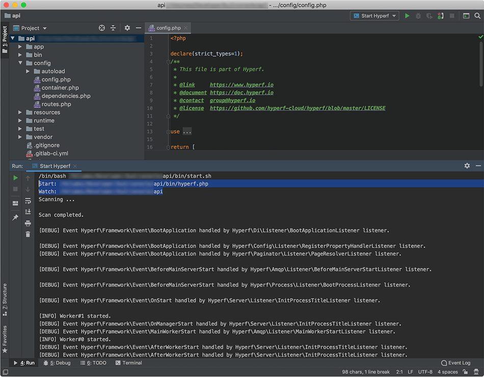

# Hyperf Reload

开发环境监听文件变化，自动重启 Hyperf-Service

⚠️当前版本仅在macos/linux测试通过，使用windows的同学欢迎试(cai)用(keng)，有问题请提交issue，会尽快调整。



## 安装

需要nodejs环境，对nodejs/npm不熟悉的同学请[移步此处](https://github.com/maosong/nodejs-install-uninsatll.git)，教你熟练掌握nodejs的安装与卸载。。。

### 1. NPM安装（推荐）

```bash
$ npm i hyperf-reload -g

$ hyperf-reload --help
```

### 2. 本地安装

```bash
$ git clone [repository] --depth=1
$ cd hyperf-reload
$ npm i

$ ./bin/hyperf-reload --help
```

## 用例

### 1. 基本

```bash
$ hyperf-reload /path/to/hyperf.php
```

### 2. 忽略指定文件(夹)的监听

默认忽略 `**/.*` `**/vendor/**` `**/test/**` `**/runtime/**` 可根据需要自定义。

```bash
$ hyperf-reload -i "**/docs/** **/.* **/vendor/** **/test/** **/runtime/**" /path/to/hyperf.php
```

⚠️ 规则请参考 [anymatch](https://www.npmjs.com/package/anymatch)

### 3. 监听多个文件夹

某些特殊情况，需要同时监听多个文件夹。

```bash
$ hyperf-reload /path/to/hyperf.php /path/to/resources1 /path/to/resources2 /path/to/resources3
```

## 便捷启动（推荐）

在 `bin` 文件夹中创建 `start.sh`

文件: /path/to/bin/start.sh

```bash
hyperfBinPath=$(cd `dirname $0`; pwd);

hyperf-reload -i "**/docs/** **/.* **/vendor/** **/test/** **/runtime/**" "${hyperfBinPath}/hyperf.php";
```

启动方式

```bash
bash bin/start.sh
```

🌞在PhpStorm中配置 `Run/Debug Configurations` 会更加方便

## 命令行参数

```
$ hyperf-reload --help

Usage: hyperf-reload [options] <hyperf-file> [watch-dirs...]

开发环境监听文件变化，自动重启 Hyperf-Service

Options:
  -i, --ignored <files>  忽略指定文件(夹)的监听 (default: "**/.* **/vendor/** **/test/** **/runtime/**")
  -i, --php <filepath>   PHP执行文件路径 (default: "php")
  -d, --debug            是否显示调试信息
  -V, --version          output the version number
  -h, --help             output usage information
```